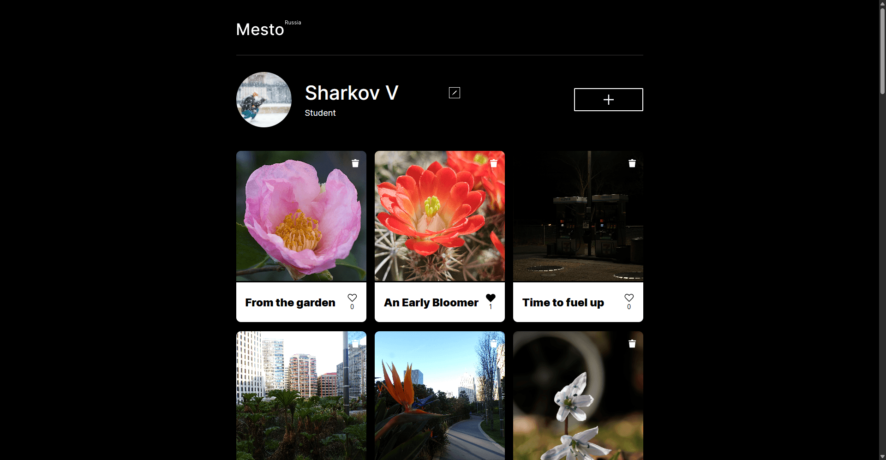
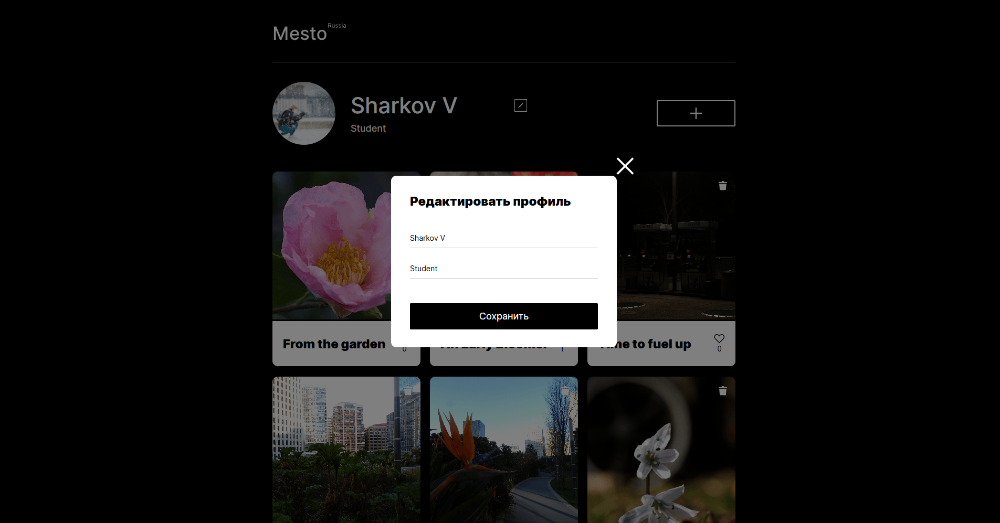
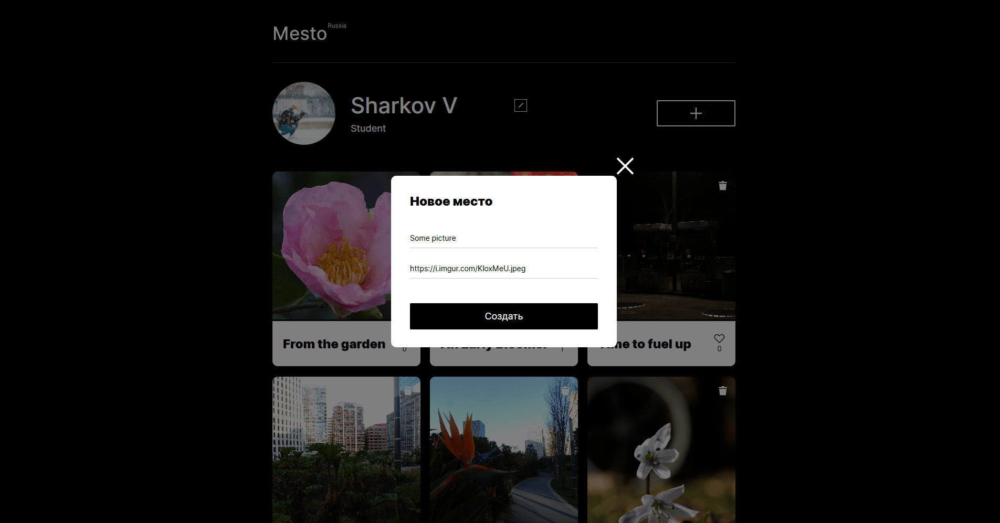
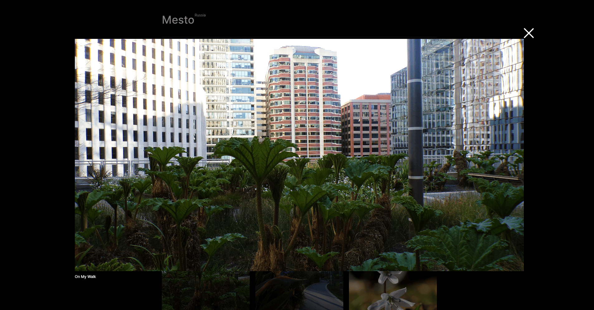
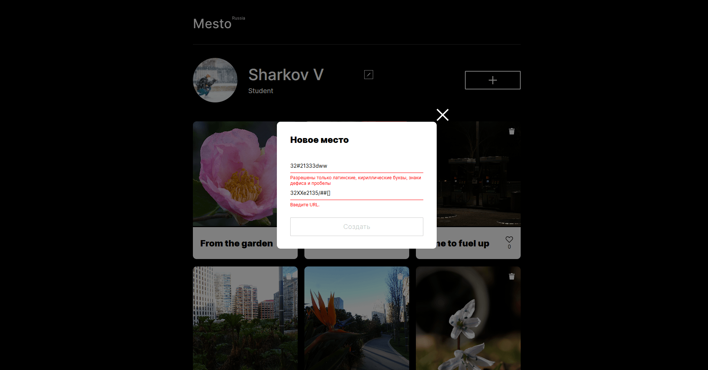

<h1 align="center">«Mesto»</h1>

  
*Интерактивный сервис для обмена фотографиями*

**Mesto** - это полноценное веб-приложение, где пользователи могут делиться фотографиями, редактировать свой профиль, ставить лайки и удалять собственные карточки. Проект демонстрирует навыки работы с JavaScript (включая асинхронные запросы к API), сборку проекта на Webpack, валидацию форм и реализацию модальных окон. Все данные сохраняются на сервере, что приближает проект к реальным условиям разработки.

## 🚀 Демо

Проект опубликован на GitHub Pages: [https://cloudxvii.github.io/mesto-project-ff/](https://cloudxvii.github.io/mesto-project-ff/)

## 🛠 Технологии

<div align="center">
  
  
  
  
  
  
  
</div>

- **HTML5** - семантическая разметка, шаблоны (`<template>`), модальные окна.
- **CSS3** - адаптивная вёрстка (flex, grid), организация кода по методологии БЭМ (Nested).
- **JavaScript (ES6+)** - модульная структура, классы, работа с DOM, обработчики событий, асинхронные запросы (fetch), валидация форм.
- **Webpack** - сборка проекта, минификация, транспиляция, горячая перезагрузка (dev-server).
- **Babel** - транспиляция современного JavaScript для поддержки старых браузеров.
- **PostCSS** - автопрефиксирование и минификация CSS.
- **API** - взаимодействие с внешним сервером для получения/обновления данных (профиль, карточки, лайки, аватар).
- **Валидация форм** - кастомная валидация с отображением ошибок и блокировкой кнопки отправки.

## ✨ Функциональность

- 👤 **Редактирование профиля** - изменение имени и информации о себе, обновление аватара (через ссылку на изображение).
- 🖼 **Добавление карточек** - создание новой карточки с названием и ссылкой на изображение.
- ❤️ **Лайки** - возможность ставить и убирать лайки на карточках других пользователей.
- 🗑 **Удаление карточек** - удаление только своих карточек (иконка удаления скрыта для чужих).
- 🔍 **Просмотр изображений** - открытие увеличенной фотографии в модальном окне.
- 📱 **Адаптивный дизайн** - корректное отображение на всех устройствах от мобильных до десктопов.
- ✅ **Валидация форм** - проверка введённых данных с выводом сообщений об ошибках; кнопка неактивна, пока форма невалидна.
- ⚡️ **Асинхронное взаимодействие** - все изменения сохраняются на сервере, интерфейс обновляется без перезагрузки страницы.

## 📸 Скриншоты

| Редактирование профиля | Добавление карточки |
|------------------------|---------------------|
|  |  |

| Просмотр изображения | Валидация формы |
|----------------------|-----------------|
|  |  |

## 🔍 Особенности реализации

- **Модульная архитектура** - код разбит на отдельные модули (`api.js`, `card.js`, `modal.js`, `validation.js`), что облегчает поддержку и расширение.
- **Классы и функции** - для создания карточек используется функция `createCard`, для управления попапами - модуль с функциями `openPopup` и `closePopup`.
- **Кастомная валидация** - реализована в модуле `validation.js`: проверка полей, отображение ошибок, управление состоянием кнопки сабмита.
- **Работа с API** - все запросы к серверу вынесены в отдельный модуль `api.js`, используются промисы и обработка ошибок.
- **Шаблоны** - карточки создаются на основе `<template>` из HTML, что упрощает динамическое добавление.
- **БЭМ-именование** - CSS-классы организованы по методологии БЭМ (файловая структура Nested), что обеспечивает читаемость и переиспользование стилей.
- **Адаптивность** - медиазапросы обеспечивают корректное отображение на экранах от 320px до 1280px.
- **Сборка Webpack** - настроена конфигурация для разработки и продакшена: минификация, обработка изображений, шрифтов, CSS-препроцессинг.

## 🧱 Структура проекта

```
mesto-project-ff/
├── src/
│   ├── blocks/            # CSS-файлы по БЭМ-блокам (nested)
│   ├── components/        # JavaScript-модули (api, card, modal, validation)
│   ├── images/            # Статические изображения (иконки, аватар по умолчанию)
│   ├── pages/             # Главный CSS-файл (index.css)
│   ├── scripts/           # Точка входа (index.js) и вспомогательные скрипты
│   ├── vendor/            # Нормалайз, шрифты
│   ├── index.html         # Главный HTML-файл
│   └── ...
├── .editorconfig
├── .gitignore
├── babel.config.js        # Настройки Babel
├── package.json
├── postcss.config.js      # Настройки PostCSS
├── README.md
└── webpack.config.js      # Конфигурация Webpack
```

## 🚦 Запуск проекта локально

```bash
# Клонируйте репозиторий
git clone https://github.com/CLoudXVII/mesto-project-ff.git

# Перейдите в папку проекта
cd mesto-project-ff

# Установите зависимости
npm install

# Запустите проект в режиме разработки (сборка и dev-сервер)
npm run dev

# Для сборки в production
npm run build
```

После выполнения `npm run dev` проект будет доступен по адресу `http://localhost:8080` (или другому, указанному в терминале).

## 🎯 Цель проекта

Проект выполнен в рамках учебной программы для закрепления навыков:

- работа с DOM и обработчиками событий на чистом JavaScript;
- создание и удаление элементов на странице динамически;
- взаимодействие с внешним API (GET, POST, PUT, DELETE);
- реализация модальных окон и валидации форм;
- организация кода с использованием модулей и методологии БЭМ;
- настройка современной сборки проекта (Webpack, Babel, PostCSS).

## 📝 Что сделано мной

- Полная реализация функциональности приложения: отображение карточек с сервера, добавление новых, лайки, удаление (только своих), редактирование профиля и аватара.
- Написание модулей для работы с API, валидации форм и управления попапами.
- Интеграция всех компонентов в единую логику с обработкой ошибок запросов.
- Настройка сборки Webpack с поддержкой изображений, шрифтов, CSS и транспиляции.
- Обеспечение адаптивной вёрстки и корректного поведения на разных разрешениях.
- Реализация кастомной валидации полей с динамическим отображением ошибок и блокировкой кнопки.
- Оптимизация кода: вынесение повторяющихся функций в модули, использование шаблонов для карточек.
